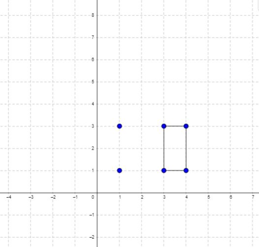

# 939. Minimum Area Rectangle

You are given an array of points in the X-Y plane `points` where `points[i] = [xi, yi]`.

Return the minimum area of a rectangle formed from these points, with sides parallel to the X and Y axes. If there is not any such rectangle, return `0`.

**Example 1:**

> **Input:** points = [[1,1],[1,3],[3,1],[3,3],[2,2]]  
> **Output:** 4

**Example 2:**

> **Input:** points = [[1,1],[1,3],[3,1],[3,3],[4,1],[4,3]]  
> **Output:** 2

**Constraints:**
- `1 <= points.length <= 500`
- `points[i].length == 2`
- `0 <= xi, yi <= 4 * 10^4`
- All the given points are unique.
